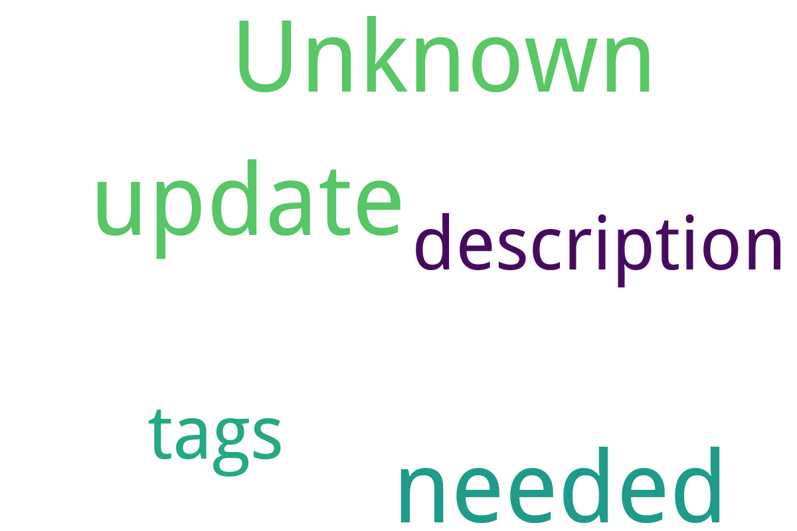

# mkdocs 中文数字档案馆模板

功能：

- 自动整理文件名
- 对于 pdf， txt，doc 等文件通过 ai 自动生成摘要分类、下载页面
- 自动生成目录
- 自动建立 mkdocs 站点
- 生成可供检索的目录

## 目录

---

## 目录

!!! note "📊 统计信息"

    总计内容：2 篇

### 📎 其他

<table>
<thead><tr>
<th style="width: 40%" data-sortable="true" data-sort-direction="asc" data-sort-type="text">标题 ▲</th>
<th style="width: 15%" data-sortable="true" data-sort-direction="desc" data-sort-type="year">年份 ▼</th>
<th style="width: 45%">摘要</th>
</tr></thead>
<tbody>
<tr data-name="wqy-microhei" data-year="None" data-date="9999-12-31">
                <td><a href="wqy-microhei.ttc" class="md-button">wqy-microhei</a></td>
                <td class="year-cell">None</td>
                <td class="description-cell">无摘要</td>
            </tr>
</tbody>
</table>

## 📁 子目录

<table>
<thead><tr>
<th style="width: 30%" data-sortable="true" data-sort-direction="asc" data-sort-type="text">目录名 ▲</th>
<th style="width: 20%" data-sortable="true" data-sort-direction="asc" data-sort-type="text">文件数量 ▲</th>
<th style="width: 50%">简介</th>
</tr></thead>
<tbody>
<tr data-name="测试" data-count="1" data-date="0000-00-00">
                <td><a href="测试" class="md-button">测试</a></td>
                <td class="count-cell">1 篇</td>
                <td class="description-cell">无简介</td>
            </tr>
</tbody>
</table>

## 📊 词云图 { data-search-exclude }

=== "最多访问"

=== "最近更新"

    * 9999-12-31 [wqy-microhei](wqy-microhei.ttc)
    * 2024-11-15 [测试](测试/测试_page)

---

## LICENSE

本项目为展示存档与资料库的模板，所有内容均来自互联网，仅供学习和研究使用。版权属于原作者。
